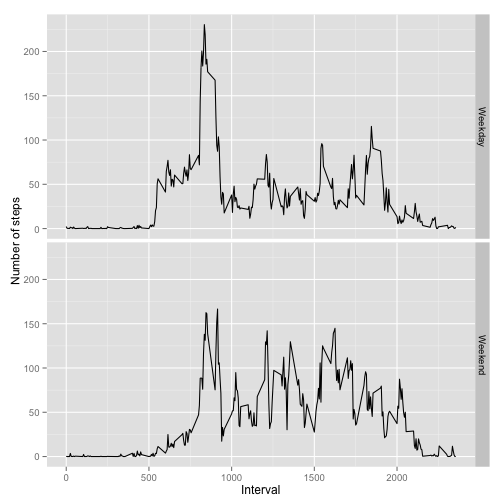

# Reproducible Research: Peer Assessment 1

## Loading and preprocessing the data

```r
options(scipen = 1, digits = 7)
library(data.table)
#data <- read.csv(unzip("activity.zip"))
data <- read.csv("activity.csv")
data$day <- as.Date(data$date, "%Y-%m-%d")
data$weekday <- weekdays(data$day)
weekday.list <- unique(data$weekday)
day.type <- c(rep("Weekday", 5), rep("Weekend", 2))
data$dayType <- day.type[match(data$weekday, weekday.list)]
dt <- data.table(data)
```

## Remove the NA values

```r
data.noNA <- data[!is.na(data$steps),]
dt.clean <- na.omit(dt)
```


## What is mean total number of steps taken per day?
Sum the steps for each day.

```r
#total.steps.by.day <- tapply(data.noNA$steps, data.noNA$date, sum)
total.steps.by.day <- dt.clean[,sum(steps), by=date]
```

Create a histogram of the mean number of steps per day.

```r
hist(total.steps.by.day$V1, main="Histogram of Total Number of Steps per Day", xlab="")
```

 

Calculate the mean of the number of steps per day.

```r
mean(total.steps.by.day$V1[!is.na(total.steps.by.day$V1)])
```

```
## [1] 10766.19
```

Calculate the median of the number of steps per day.

```r
median(total.steps.by.day$V1)
```

```
## [1] 10765
```

## What is the average daily activity pattern?
Take the average number of steps by the interval across days.

```r
#steps.by.daily.interval <- aggregate(steps ~ interval, data.noNA, FUN="mean")
steps.by.daily.interval <- dt.clean[,mean(steps), by=interval]
with(steps.by.daily.interval, plot(interval, V1, type="l", 
                                   main="Average Daily Activity Pattern", 
                                   xlab="Interval (5 minute increment)",
                                   ylab="Average Number of Steps"))
```

 

Interval with the maximum number of steps on average across the day.

```r
steps.by.daily.interval$interval[steps.by.daily.interval$V1 == max(steps.by.daily.interval$V1)]
```

```
## [1] 835
```

## Imputing missing values
Total number of mission values in original data.

```r
sum(is.na(dt$steps))
```

```
## [1] 2304
```

For simplicity replace missing values with the average daily number of steps for that interval.
Round the average number of steps to a whole value since there are not partial steps.

```r
dt.with.avg <- merge(dt, steps.by.daily.interval, by="interval")
na.idx <- which(is.na(dt.with.avg$steps))
dt.with.avg$steps[na.idx] <- round(dt.with.avg$V1[na.idx],0)
```


Find the number of steps per day for new data set.

```r
setkey(dt.with.avg, date, interval)
total.steps.2 <- dt.with.avg[,sum(steps), by=date]
```

Histogram with the total number of steps taken per day

```r
hist(total.steps.2$V1, main="Histogram of Total Number of Steps per Day with NAs Replaced with Avg for Interval", xlab="")
```

 

Calculate the mean of the number of steps per day.

```r
mean(total.steps.2$V1)
```

```
## [1] 10765.64
```

Calculate the median of the number of steps per day.

```r
median(total.steps.2$V1)
```

```
## [1] 10762
```

### Brief discussion of changes due to replacing NA values
The overall shape of the distribution remained the same with a higher peak.
The mean was almost the same which makes sense given that the rounded average of each interval was used to fill in the 
corresponding interval with a missing value.
The median moved only slightly due to the addition of additional values since the mean and median of the observations with step values were very close. 

## Are there differences in activity patterns between weekdays and weekends?

Split new data by weekday or weekend. Then Compute average steps per interval using new data. Identify if days are a weekday or a weekend.

```r
dt.with.avg$dayType <- factor(dt.with.avg$dayType)
interval.steps <- dt.with.avg[,mean(steps), by=c("interval","dayType")]
library(ggplot2)
ggplot(interval.steps, aes(interval, V1)) + geom_line() + xlab("Interval") + ylab("Number of steps") + facet_grid(dayType ~ .)
```

 
